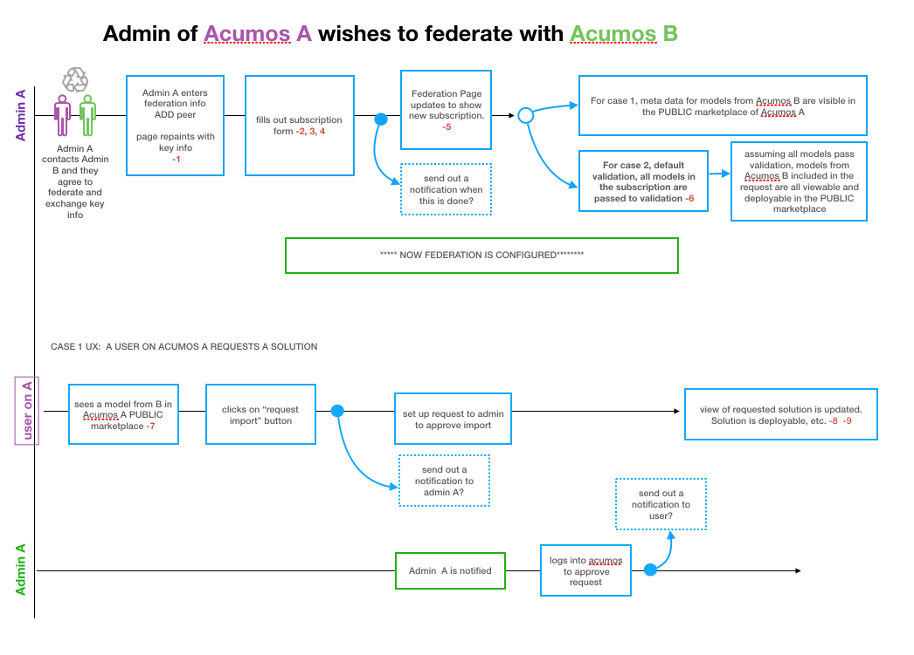

.. ===============LICENSE_START=======================================================
.. Acumos CC-BY-4.0
.. ===================================================================================
.. Copyright (C) 2017-2018 AT&T Intellectual Property & Tech Mahindra. All rights reserved.
.. ===================================================================================
.. This Acumos documentation file is distributed by AT&T and Tech Mahindra
.. under the Creative Commons Attribution 4.0 International License (the "License");
.. you may not use this file except in compliance with the License.
.. You may obtain a copy of the License at
..
.. http://creativecommons.org/licenses/by/4.0
..
.. This file is distributed on an "AS IS" BASIS,
.. WITHOUT WARRANTIES OR CONDITIONS OF ANY KIND, either express or implied.
.. See the License for the specific language governing permissions and
.. limitations under the License.
.. ===============LICENSE_END=========================================================

.. _federation:

==========
Federation
==========

Federation enables peering of Acumos sites for the purpose of developing
a broader public marketplace of models. Federation involves several main
processes described in the following sections:

-  Establishing connectivity between peers

-  Creating peer relationships between portals

-  Subscribing to models published in the public marketplace of peers

Following is an overview of the federation process.

Once connectivity has established between peers, and a peer relationship
established in the admin UI (step 1 below), the local admin can setup a
public marketplace subscription to some set of models from the peer
(steps 2-4 below) and receive confirmation that the subscription is
setup (step 5 below). An optional step at this point is the validation
of the models received over the federation API, prior to insertion of
their metadata (not the actual model artifacts) into the local portal’s
public marketplace.

A user of the local portal can then discover new models and request
access to them, which may need to be approved by a local admin, per the
local admin’s customization of the related workflow. Once approved, the
model artifacts are retrieved and stored in local repositories, and made
available for the user to download, launch, etc.

The federation process is outlined below:

Configuring an Acumos Instance for Federation
=============================================
Instructions are in the :doc:`../../../submodules/federation/docs/config`.

Establishing connectivity between peers
=======================================

Peer relationships are initiated and negotiated by peer
companies/organizations through processes outside the scope of this
guide, and may depend upon network provisioning also outside the scope
of this guide. Once peering has been agreed to, the following steps are
required as prerequisites to the use of the portal UI for setting up
federation:

-  Since portals and related public APIs are accessed only over HTTPS,
   each portal must have at least one SSL certificate to use for the
   following publicly exposed services and API endpoints, or one
   certificate for each:

   -  Portal web service and onboarding API endpoint, both accessed
      through an HTTPS proxy setup as part of portal deployment. Further
      description of these aspects are provided in ***(TODO: link to
      portal deployment guide)***

   -  The federation API endpoint

-  Each peer shares their public certificate or certificate authority
   (CA) details for the federation API endpoint, and the other peer
   installs the CA certificate by:

   -  On the host of the federation-gateway service, importing the CA
      cert into the SSL truststore as setup for federation-gateway.

   -  restarting their federation-gateway service, and verifying basic
      connectivity to the peer gateway.

Creating peer relationships between portals
===========================================

Enable Federation
-----------------

The first step in creating peer relationships to enable federation
overall, but clicking the slider on the upper-right of the Federation
tab, labeled as “Federation”. By default, this shows as “Disabled”, and
when clicked will change to “Enabled”. ***TODO: clarify the effect that
enabling or disabling federation has on the following processes***

Add Peer
--------

Selecting the “Add Peer” button will present a dialog in which a peer
relationship can be defined and validated, with the options:

-  Peer Name (mandatory): name to assign this peer in the peer list.
   ***TODO: clarify any syntax/semantic restrictions/implications***

-  Peer Admin Email (mandatory): must be a valid format email address,
   and not already used for some other peer

-  Server FQDN (mandatory): Domain name associated with a valid server
   certificate as signed by the peer CA as described above. The domain
   name must be resolvable via DNS, or by local host configuration (for
   an example of the latter, see the OnClick Deploy guide) ***(TODO:
   link to guide)***

-  API Url (mandatory): URL for the peer federation API endpoint. Must
   be of the form “https:<FQDN or IP address>:<port configured for the
   federation API>”.

-  Description (optional): Anything that helps describe this peer.

-  Validation Not Required (optional): Enables subscribed models to be
   listed in the marketplace without pre-validation. ***(TODO: link to
   validation guide)***

    .. image:: images/admin-peer-add.png

Actions on peer list entries
============================

Once a peer has been added, it is displayed in the list of peers. The
list provides various information and actions for peer entries:

-  Name, gateway info, contact: as entered in the “Add Peer” dialog

-  Subscriptions: manage subscriptions (see section below)

-  Status: “inactive” when the peer is added; “active” once the
   “Activate” icon (|Activate|) is clicked. Goes back to “inactive” when
   the “Deactivate” icon (|Deactivate|) is clicked. ***TODO: clarify effects
   of activation/deactivation***

    .. |Activate| image:: images/admin-activate.png

    .. |Deactivate| image:: images/admin-deactivate.png

    .. |Edit| image:: images/admin-edit.png

    .. |Delete| image:: images/admin-delete.png

-  Status change icon: “Activate” icon (|Activate|) when added or
   inactive, or “Deactivate” icon (Deactivate|) when active.

-  Edit (|Edit|): edit peer details (see section below)

-  Delete (|Delete|): removes the peer entry

-  Self: identifies whether the peer entry is for the local portal as
   selected when the peer was added. “Mark as Self” when added or
   currently not set to self. “Remove as Self” when set to self.
   Clicking the current setting will toggle to the other value.

    .. image:: images/admin-peer-list.png

Edit Peer
=========

Selecting the “Edit Peer” icon (|Edit|) will bring up the same dialog
as “Add Peer” with the addition of the “Verify” button being selectable.

Selecting the “Verify” button will:

-  ***TODO: clarify what the verify does, affects, and any subsequent
   actions once a verification process is successful/unsuccessful***

Subscriptions
=============

Selecting “View/Add” in the “Subscriptions” column will bring up a
dialog for management of subscriptions with the peer. When first added,
the peer subscriptions list will be empty.

    .. image:: images/admin-subscriptions-view.png

Add Subscription
----------------

Selecting “New Subscription” in the “View/Add Subscriptions” dialog will
display search options for models in the peer catalog:

    .. image:: images/admin-subscription-add.png

In the “Model ID” field, to search for a specific model by ID (the ID
displayed in a browser location field when you are browsing the model,
e.g. “solutionId=079779dd-6962-4f7e-8655-fe6310242b81”), enter the ID
(e.g. 079779dd-6962-4f7e-8655-fe6310242b81), and if that model is
available in the remote marketplace it will appear in the dialog, e.g.:

    .. image:: images/admin-subscription-add-bymodel.png

Other options include:

-  To search by Category (Classification, Data Sources, Data
   Transformer, Prediction, Regression), select the category from the
   “Category” drop-down. To narrow the search to a specific toolkit
   within that category, or to search only by toolkit, select the
   toolkit (Composite Solution, Design Studio, H2O, Probe, R,
   Scikit-Learn, TensorFlow, Data Broker, Training Client, ONAP).

-  To search for all models, select the “All Models” box. ***TODO:
   explain why it may not be selectable***

If any matching models are available in the remote marketplace they will
appear in the dialog, e.g. as below. From here you can select:

-  select an automatic refresh of models matching the search criteria
   (Hourly, Daily, Monthly) from the “Select Frequency of Update”
   drop-down. Or select “Update on demand” for manual updates.

-  “Full Access” or “Partial Access”: ***TODO: describe***

-  Clear Catalog: ***TODO: describe***

    .. image:: images/admin-subscription-add-search-result.png

To save the subscription as selected above, select the “Add To
Subscription List” button. The subscription will be added to the list
for this peer, e.g. as below.

    .. image:: images/admin-subscription-list.png

To see the details for a subscription, select the “+” icon, which will
expand the display with details and options, e.g. as below. From here
you can:

-  Select a new “Frequency of Update”

-  Delete the subscription by selecting the trashcan icon (image18)

-  Preview: ***TODO: describe the function***

-  Trigger: ***TODO: describe the function***

    .. image:: images/admin-subscription-detail-view.png

Managing Subscription Requests
==============================

The “Requests” tab enables an admin to manage subscription requests.
*This tab is not fully implemented, but it will enable these options:*

.. |Approve| image:: images/admin-approve.png

.. |Deny| image:: images/admin-deny.png

-  Approve, by selecting the check icon (|Approve|)

-  Deny, by selecting the ‘X’ icon (|Deny|)

***TODO: further explain what happens upon these actions***

    .. image:: images/admin-requests.png