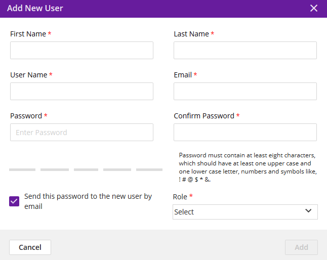
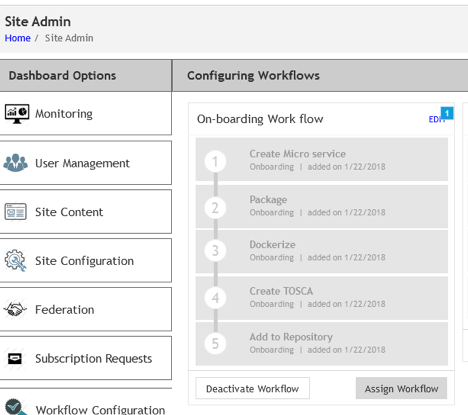

.. ===============LICENSE_START=======================================================
.. Acumos CC-BY-4.0
.. ===================================================================================
.. Copyright (C) 2017-2018 AT&T Intellectual Property & Tech Mahindra. All rights reserved.
.. ===================================================================================
.. This Acumos documentation file is distributed by AT&T and Tech Mahindra
.. under the Creative Commons Attribution 4.0 International License (the "License");
.. you may not use this file except in compliance with the License.
.. You may obtain a copy of the License at
..
.. http://creativecommons.org/licenses/by/4.0
..
.. This file is distributed on an "AS IS" BASIS,
.. WITHOUT WARRANTIES OR CONDITIONS OF ANY KIND, either express or implied.
.. See the License for the specific language governing permissions and
.. limitations under the License.
.. ===============LICENSE_END=========================================================

==================================
Portal and Marketplace Admin Guide
==================================

Introduction
============

This user guide  describes how to use the Admin Interface for Acumos portals.

What is Covered by the Admin Interface?
---------------------------------------

The Admin Interface is a web-based tool for a site admin to:

1. Monitor the site activity

2. Manage users and change their roles.

3. Update and edit the site content that is managed by the CMS.

4. Configure the site.

5. Manage Federation relationships: configure peer gateways and set up
   subscriptions to that peer’s public marketplace.

6. Manage Federation requests for specific models.

7. Configure workflows.

Admin Access to the Acumos Portal
---------------------------------

When a new Acumos Portal is deployed, a default admin user will be
created in the process of deployment by common-dataservice database
setup scripts. A default username (“***TBD***\ ”) *and* password
(“***TBD***\ ”) will be assigned to the admin, and must be changed upon
first login, as the password will be set to “expired” when created.

Users can be assigned the role of Admin via the Portal UI at “Site
Admin” / “User Management”. Select the user and pick “admin” under the
“Change Role To” dropdown. The user will need to logout and back in for
the “Site Admin” tools to be visible.

The Site Admin Dashboard provides the toolset that admins use to manage
the Acumos portal. The Site Admin Dashboard can be accessed by site
admins only. Admins will have the “SITE ADMIN” option on the left of the
portal UI when they login.

The following sections address each tool under the Site Admin Dashboard.

Site Monitoring
===============

Via the “Site Admin” / “Monitoring” tab, admins will be able to monitor
various Acumos portal aspects such as user and modeler activity.

This section of Site Admin is in development, and currently presents
static data. This section will be updated as new features are
implemented.

User Management
===============

This tab lists all user accounts on the portal, and enables:

-  Searching for users, and selecting a list of users by role

-  Adding a user

-  Bulk activation, inactivation, and deletion of users

-  Changing the role of a user to one of the defined roles “MLP system
   user” (normal user) and “admin”

-  Creation of new roles that enable use of various portal features

The following sections describe the dialogs presented under User
Management.

Add New User
------------

Selecting the “Add New User” button will present a dialog in which new
user details can be provided, including:

-  First Name (mandatory)

-  Last Name (mandatory)

-  User Name (mandatory): must be unique, and not already used for some
   other account

-  Email (mandatory): must be a valid format email address, and not
   already used for some other account

-  Password (mandatory): must contain at least eight characters, which
   should have at least one upper case and one lower case letter,
   numbers and symbols like, ! # @ $ \* &. If the password is determined
   to be “weak”, a stronger password must be selected or the “Add”
   button will not be selectable.

-  Role (mandatory): one of the defined roles, by default “MLP System
   User”, “admin”

An option to send the new user an account creation email is provided.
The email will be sent from the defined email address of the admin user
that added the new user.

Add New Role
------------

Selecting the “Add New Role” button will present a dialog in which roles
can be defined, with the options:

-  Role Name (mandatory): must be unique, i.e. not already used as a
   role name

-  Role Name (mandatory): Assignment of one or more of the following
   permissions:

   -  Access to the Design Studio

   -  Access to the Marketplace

   -  Access to Onboarding

***TODO: provide further description of these permissions***

.. image:: images/admin-role-add.png

Site Content
============

This tab is under development. This section will be updated as new
features are implemented.

Site Configuration
==================

This tab enables configuration of the following:

-  Logos enabling the portal owner (typically a company or other
   organization) to brand the site: ***TODO: explain how these are
   presented***

   -  Co-Branding Logo

   -  Header Logo

   -  Footer Logo

-  siteInstanceName: Name for the portal site, used to differentiate the
   site when users first visit (before login), ala “Explore the
   <siteInstanceName> Marketplace”, “Discover <siteInstanceName>”, etc.

-  ConnectionConfig: set parameters for networking ***(TODO: clarify how
   these are used)***

   -  socketTimeout

   -  connectionTimeout

-  EnableOnboarding: option to enable or disable the onboarding feature
   for modelers

-  validationText: If you have Text Check configured as part of your Publishing workflow (`Link <Configure Workflows>`_), a keyword scan will be performed on a model's artifacts. That keyword scan will use the comma separated list of keywords entered in this field.

Federation
==========

Federation enables peering of Acumos sites for the purpose of developing
a broader public marketplace of models. Federation involves several main
processes described in the following sections:

-  Establishing connectivity between peers

-  Creating peer relationships between portals

-  Subscribing to models published in the public marketplace of peers

Following is an overview of the federation process.

Once connectivity has established between peers, and a peer relationship
established in the admin UI (step 1 below), the local admin can setup a
public marketplace subscription to some set of models from the peer
(steps 2-4 below) and receive confirmation that the subscription is
setup (step 5 below). An optional step at this point is the validation
of the models received over the federation API, prior to insertion of
their metadata (not the actual model artifacts) into the local portal’s
public marketplace.

A user of the local portal can then discover new models and request
access to them, which may need to be approved by a local admin, per the
local admin’s customization of the related workflow. Once approved, the
model artifacts are retrieved and stored in local repositories, and made
available for the user to download, launch, etc.

The federation process is outlined below:

.. image:: images/admin-federate-user-journey.png

Establishing connectivity between peers
---------------------------------------

Peer relationships are initiated and negotiated by peer
companies/organizations through processes outside the scope of this
guide, and may depend upon network provisioning also outside the scope
of this guide. Once peering has been agreed to, the following steps are
required as prerequisites to the use of the portal UI for setting up
federation:

-  Since portals and related public APIs are accessed only over HTTPS,
   each portal must have at least one SSL certificate to use for the
   following publicly exposed services and API endpoints, or one
   certificate for each:

   -  Portal web service and onboarding API endpoint, both accessed
      through an HTTPS proxy setup as part of portal deployment. Further
      description of these aspects are provided in ***(TODO: link to
      portal deployment guide)***

   -  The federation API endpoint

-  Each peer shares their public certificate or certificate authority
   (CA) details for the federation API endpoint, and the other peer
   installs the CA certificate by:

   -  On the host of the federation-gateway service, importing the CA
      cert into the SSL truststore as setup for federation-gateway.

   -  restarting their federation-gateway service, and verifying basic
      connectivity to the peer gateway.

.. note::

    See the ***(TODO: link to portal deployment guide)*** for details on
    these steps.

Creating peer relationships between portals
-------------------------------------------

Enable Federation
~~~~~~~~~~~~~~~~~

The first step in creating peer relationships to enable federation
overall, but clicking the slider on the upper-right of the Federation
tab, labeled as “Federation”. By default, this shows as “Disabled”, and
when clicked will change to “Enabled”. ***TODO: clarify the effect that
enabling or disabling federation has on the following processes***

Add Peer
~~~~~~~~

Selecting the “Add Peer” button will present a dialog in which a peer
relationship can be defined and validated, with the options:

-  Peer Name (mandatory): name to assign this peer in the peer list.
   ***TODO: clarify any syntax/semantic restrictions/implications***

-  Peer Admin Email (mandatory): must be a valid format email address,
   and not already used for some other peer

-  Server FQDN (mandatory): Domain name associated with a valid server
   certificate as signed by the peer CA as described above. The domain
   name must be resolvable via DNS, or by local host configuration (for
   an example of the latter, see the OnClick Deploy guide) ***(TODO:
   link to guide)***

-  API Url (mandatory): URL for the peer federation API endpoint. Must
   be of the form “https:<FQDN or IP address>:<port configured for the
   federation API>”.

-  Description (optional): Anything that helps describe this peer.

-  Validation Not Required (optional): Enables subscribed models to be
   listed in the marketplace without pre-validation. ***(TODO: link to
   validation guide)***

Actions on peer list entries
----------------------------

Once a peer has been added, it is displayed in the list of peers. The
list provides various information and actions for peer entries:

-  Name, gateway info, contact: as entered in the “Add Peer” dialog

-  Subscriptions: manage subscriptions (see section below)

-  Status: “inactive” when the peer is added; “active” once the
   “Activate” icon (|Activate|) is clicked. Goes back to “inactive” when
   the “Deactivate” icon (|Deactivate|) is clicked. ***TODO: clarify effects
   of activation/deactivation***

-  Status change icon: “Activate” icon (|Activate|) when added or
   inactive, or “Deactivate” icon (Deactivate|) when active.

-  Edit (|Edit|): edit peer details (see section below)

-  Delete (|Delete|): removes the peer entry

-  Self: identifies whether the peer entry is for the local portal as
   selected when the peer was added. “Mark as Self” when added or
   currently not set to self. “Remove as Self” when set to self.
   Clicking the current setting will toggle to the other value.

image1s/admin-peer-list.png

Edit Peer
---------

Selecting the “Edit Peer” icon (|Edit|) will bring up the same dialog
as “Add Peer” with the addition of the “Verify” button being selectable.

Selecting the “Verify” button will:

-  ***TODO: clarify what the verify does, affects, and any subsequent
   actions once a verification process is successful/unsuccessful***

Subscriptions
-------------

Selecting “View/Add” in the “Subscriptions” column will bring up a
dialog for management of subscriptions with the peer. When first added,
the peer subscriptions list will be empty.

Add Subscription
~~~~~~~~~~~~~~~~

Selecting “New Subscription” in the “View/Add Subscriptions” dialog will
display search options for models in the peer catalog:

In the “Model ID” field, to search for a specific model by ID (the ID
displayed in a browser location field when you are browsing the model,
e.g. “solutionId=079779dd-6962-4f7e-8655-fe6310242b81”), enter the ID
(e.g. 079779dd-6962-4f7e-8655-fe6310242b81), and if that model is
available in the remote marketplace it will appear in the dialog, e.g.:

Other options include:

-  To search by Category (Classification, Data Sources, Data
   Transformer, Prediction, Regression), select the category from the
   “Category” drop-down. To narrow the search to a specific toolkit
   within that category, or to search only by toolkit, select the
   toolkit (Composite Solution, Design Studio, H2O, Probe, R,
   Scikit-Learn, TensorFlow, Data Broker, Training Client, ONAP).

-  To search for all models, select the “All Models” box. ***TODO:
   explain why it may not be selectable***

If any matching models are available in the remote marketplace they will
appear in the dialog, e.g. as below. From here you can select:

-  select an automatic refresh of models matching the search criteria
   (Hourly, Daily, Monthly) from the “Select Frequency of Update”
   drop-down. Or select “Update on demand” for manual updates.

-  “Full Access” or “Partial Access”: ***TODO: describe***

-  Clear Catalog: ***TODO: describe***

To save the subscription as selected above, select the “Add To
Subscription List” button. The subscription will be added to the list
for this peer, e.g. as below.

To see the details for a subscription, select the “+” icon, which will
expand the display with details and options, e.g. as below. From here
you can:

-  Select a new “Frequency of Update”

-  Delete the subscription by selecting the trashcan icon (image18)

-  Preview: ***TODO: describe the function***

-  Trigger: ***TODO: describe the function***

Managing Subscription Requests
------------------------------

The “Requests” tab enables an admin to manage subscription requests.
*This tab is not fully implemented, but it will enable these options:*

-  Approve, by selecting the check icon (|Approve|)

-  Deny, by selecting the ‘X’ icon (|Deny|)

***TODO: further explain what happens upon these actions***

Configure Workflows
===================

A number of Acumos tasks, such as on-boarding and publishing require the
user to complete a series of tasks and then initiate a back-end workflow
to complete the overall task. The workflow can be described as a series
of steps, all of which must succeed to complete the overall task.

The Admin of a Acumos system may include or omit steps from the back-end
workflow to customize their local instance.

UI for Workflow Configuration
-----------------------------

When “Configure Workflows” is selected, the current set of workflows and
currently configured steps is displayed. When the Acumos portal is
deployed, this will include the system default workflows for
“On-boarding”, “Publishing to Local”, “Publishing To Public” and “Import
Federated Model Work”, e.g. as below. Options from here:

-  Deactivate or Assign any workflow

-  Modify any workflow, by adding or deleting optional steps

   -  Grayed-out steps are mandatory and cannot be deleted or modified

   -  Optional steps have a “bar-in-circle” icon (|Delete-step|) which
      enables the step to be deleted, e.g. the Security Scan step as
      optional for the Onboarding work flow

Example: Change workflow for On-boarding
----------------------------------------

Select the correct workflow and choose the EDIT button.

The detailed steps are shown, including the optional SECURITY step. If
the SECURITY step is currently not included, and Admin wishes to add it,
they click on the **+** symbol for that step.

Adding a Security Step:

Deleting a Security Step: Click on the **“-“** button”.

.. image:: images/admin-workflow-step-delete.png

Result: The new security step is shown in the workflow. To implement
the change, the Admin must select **Assign Workflow** button.

