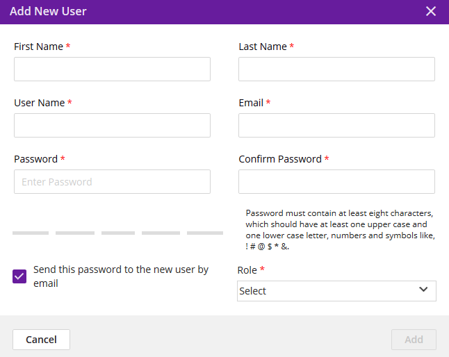
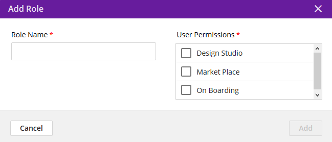

.. ===============LICENSE_START=======================================================
.. Acumos CC-BY-4.0
.. ===================================================================================
.. Copyright (C) 2017-2018 AT&T Intellectual Property & Tech Mahindra. All rights reserved.
.. ===================================================================================
.. This Acumos documentation file is distributed by AT&T and Tech Mahindra
.. under the Creative Commons Attribution 4.0 International License (the "License");
.. you may not use this file except in compliance with the License.
.. You may obtain a copy of the License at
..
.. http://creativecommons.org/licenses/by/4.0
..
.. This file is distributed on an "AS IS" BASIS,
.. WITHOUT WARRANTIES OR CONDITIONS OF ANY KIND, either express or implied.
.. See the License for the specific language governing permissions and
.. limitations under the License.
.. ===============LICENSE_END=========================================================

.. _user-management:

===============
User Management
===============

This tab lists all user accounts on the portal and enables:

-  Searching for users and selecting a list of users by role

-  Adding a user

-  Bulk activation and deactivation of users

-  Changing the role of a user to one or more of the system roles

-  Creation of new roles that restrict use of various portal features

System Roles
============
.. csv-table::
    :header: "Role", "Description", "Permissions"
    :widths: 20, 40, 40
    :align: left

    "MLP System User", "Default role assigned to new accounts", "On-board a model, use the Design Studio and Marketplace"
    "Admin", "Portal Administration", "MLP System User, site administration"
    "Publisher", "Model Publishing", "MLP System User, publish models to the Public Marketplace"

Add New User
============

Selecting the “Add New User” button will present a dialog in which new
user details can be provided, including:

-  First Name (mandatory)

-  Last Name (mandatory)

-  User Name (mandatory): must be unique, and not already used for some
   other account

-  Email (mandatory): must be a valid format email address, and not
   already used for some other account

-  Password (mandatory): must contain at least eight characters, which
   should have at least one upper case and one lower case letter,
   numbers and symbols like, ! # @ $ \* &. If the password is determined
   to be “weak”, a stronger password must be selected or the “Add”
   button will not be selectable.

-  Role (mandatory): one of the defined roles, by default “MLP System
   User”, “admin”

An option to send the new user an account creation email is provided.
The email will be sent from the defined email address of the admin user
that added the new user.

Add New Role
============

Selecting the “Add New Role” button will present a dialog in which roles
can be defined, with the options:

-  Role Name (mandatory): must be unique, i.e. not already used as a
   role name

-  Role Name (mandatory): Assignment of one or more of the following
   permissions:

   -  Access to the Design Studio

   -  Access to the Marketplace

   -  Access to Onboarding

***TODO: provide further description of these permissions***

