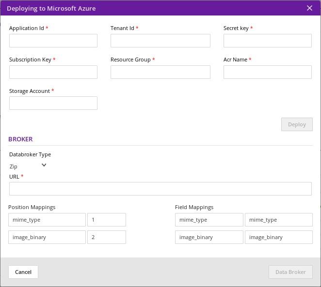

.. ===============LICENSE_START=======================================================
.. Acumos CC-BY-4.0
.. ===================================================================================
.. Copyright (C) 2017-2018 AT&T Intellectual Property & Tech Mahindra. All rights reserved.
.. ===================================================================================
.. This Acumos documentation file is distributed by AT&T and Tech Mahindra
.. under the Creative Commons Attribution 4.0 International License (the "License");
.. you may not use this file except in compliance with the License.
.. You may obtain a copy of the License at
..
.. http://creativecommons.org/licenses/by/4.0
..
.. This file is distributed on an "AS IS" BASIS,
.. WITHOUT WARRANTIES OR CONDITIONS OF ANY KIND, either express or implied.
.. See the License for the specific language governing permissions and
.. limitations under the License.
.. ===============LICENSE_END=========================================================

=================
Deploying a Model
=================

Logged-in users may deploy a model's microservice to the Cloud of their choice.

#. Locate the Model Detail Page for the model of interest
#. Click on the **Deploy to Cloud** dropdown arrow and select the Cloud
   of your choice;  note: unsupported Clouds are disabled in the dropdown menu
#. In this example, select Azure
#. Complete the information in the detail pop-up
#. Click **Add** on the bottom right

    .. image:: ../images/portal/models_deployToCloudSteps.png

Deploying to Azure
==================

Microsoft Azure is a cloud computing service created by Microsoft for building, testing, deploying, and managing applications and services through a global network of Microsoft-managed data centers.

Acumos is able to deploy models and composite models easily in an Azure cloud. It creates a new virtual machine and deploys the model in that VM.

A Composite Solution is combination of more than one model. The Model Connector is also deployed with composite  solutions since it is used for communication between models in the VM. Databroker details can be specified for a composite model. If a Databroker image is available in the composite solution, then it will also be deployed.

Upon successful deployment, the user is notified of the model connector endpoint and optionally, the databroker.

Fields
------

#. **Application ID** The ID for  application  during  registrations in Azure Active Directory
#. **TenantID** The ID of the AAD (Azure Active Directory)  in which  application is created
#. **Secret key**  Client Secret key for a web application registered with Azure Active Directory
#. **Subscription Key** Subscription grants access to  Azure services and to the Azure Platform Management Portal
#. **Resource Group**  Resource groups provide a way to monitor, control access, provision and manage billing for collections of assets that are required to run an application, or used by a client or company department
#. **Acr Name** Same as ApplicationID
#. **Storage Account** An Azure storage account provides a unique namespace to store and access Azure Storage data objects. All objects in a storage account are billed together as a group

