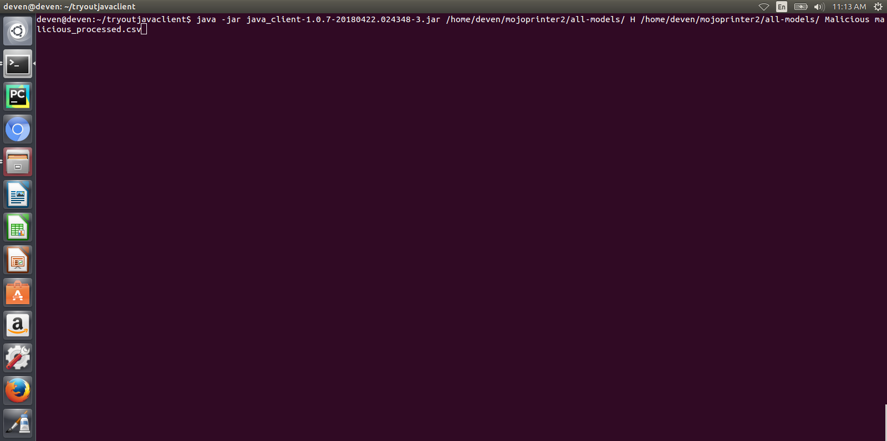
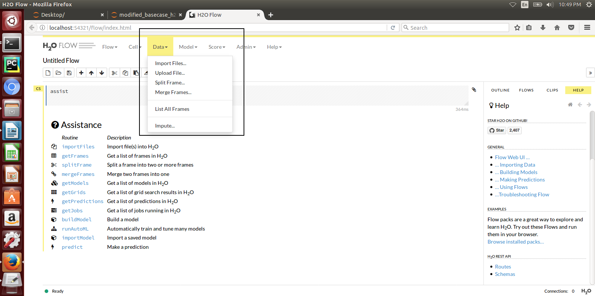
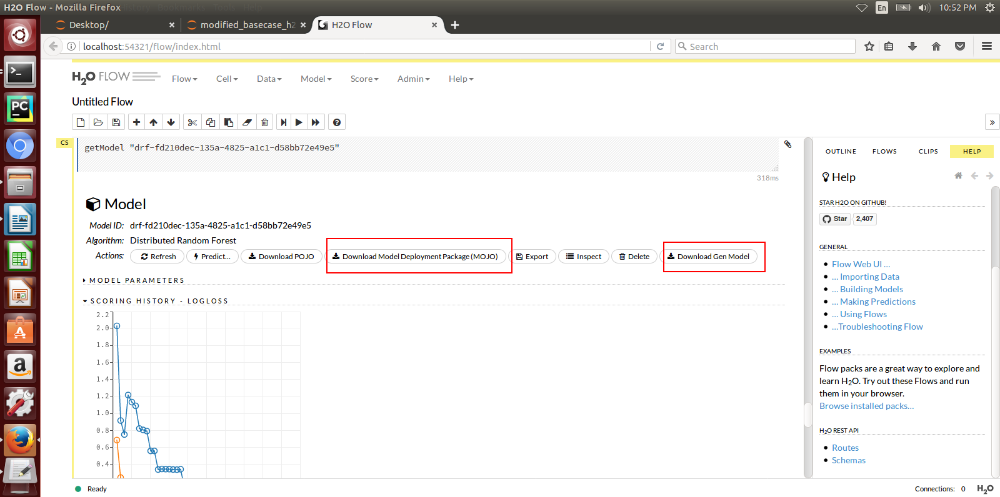

.. ===============LICENSE_START=======================================================
.. Acumos CC-BY-4.0
.. ===================================================================================
.. Copyright (C) 2017-2018 AT&T Intellectual Property & Tech Mahindra. All rights reserved.
.. ===================================================================================
.. This Acumos documentation file is distributed by AT&T and Tech Mahindra
.. under the Creative Commons Attribution 4.0 International License (the "License");
.. you may not use this file except in compliance with the License.
.. You may obtain a copy of the License at
..
.. http://creativecommons.org/licenses/by/4.0
..
.. This file is distributed on an "AS IS" BASIS,
.. WITHOUT WARRANTIES OR CONDITIONS OF ANY KIND, either express or implied.
.. See the License for the specific language governing permissions and
.. limitations under the License.
.. ===============LICENSE_END=========================================================

==========================================
On-Boarding H2o.ai and Generic Java Models
==========================================

The Acumos Java Client Library command line utility is used to on-board H2o.ai and Generic Java models. This library creates artifacts from an H2o or Generic Java model and pushes the artifacts to the on-boarding server for the H2o Model runner to be able to use them.

High-Level Flow
===============

#) The Modeler creates a model in H2o and exports it in the MOJO model format (.zip file) using any interface (eg.Python, Flow, R) provided by H2o. For Generic Java, the Modeler creates a model and exports it in the .jar format.
#) The Modeler runs the JavaClient jar, which creates a Protobuf (default.proto) file for the Model, creates the required metadata.json file and an artifact called modelpackage.zip.
#) Depending on the choice of the Modeler, she can manually upload these generated artifacts to the Acumos Marketplace via its Web interface. This is Web-based on-boarding. We will see how to do this in this article.
#) Or the Java client library itself, on-boards the model onto the on-boarding server if the modeler provides the on-boarding server URL. This is CLI-based on-boarding.

The Model Runner provides a wrapper around the ML model, packages it as a containerized microservice and exposes a predict method as a REST endpoint. When the model is onboarded and deployed, this method (REST endpoint) can then be called by other external applications to request predictions off of the model.

Prerequisites
=============

- Java 1.8
- The latest `Java Client <https://nexus.acumos.org/#nexus-search;quick~java-client>`_ jar file
- The `H2o Generic Model Runner <https://nexus.acumos.org/#nexus-search;h2o-genericjava-modelrunner>`_

Preparing to On-Board your H2o or a Generic Java Model
======================================================

Place JavaClient.jar in one folder locally. This is the folder from which you intend to run the jar. After the jar runs, the created artifacts will also be available in this folder. You will use some of these artifacts if you are doing Web-based onboarding. We will see this later. Create an additional supporting folder which will contain all that the JavaClient.jar needs to run. It will contain:

#) Models - In case of H2o, your model will be a MOJO zip file. In case of Generic Java, your model will be .jar file. We have included sample models for you to play around with.
#) Protobuf compiler for java version 3.4.0 - Download `protobuf-java-3.4.0.jar <http://central.maven.org/maven2/com/google/protobuf/protobuf-java/3.4.0/>`_ and place it in this folder.
#) Model runner or Service jar - For H2o rename h2o-genericjava-modelrunner.jar obtained from the 1st section to abcService.jar if your model name is abc. Place it in this folder. Rename the jar as GenericModelService.jar for Generic Java on-boarding
#) csv file used for training the model - Place the csv file (with header having the same column names used for training) you used for training the model here. This is used for autogenerating the .proto file. If you don't have the .proto file, you will have to supply the .proto file yourself in the supporting folder. Make sure you name it default.proto
#) default.proto - This is only needed if you don't have the csv file used to train the model. In this case, Java Client cannot autogenerate the .proto file. You will have to supply the .proto file yourself in the supporting folder. Make sure you name it default.proto Also make sure, the default.proto file for the model is in the following format. You need to appropriately replace the data and datatypes under DataFrameRow and Prediction according to your model. **See the code block below**.
#) application.properties file - Mention the port number here. This is the port where the model will expose its service.
#) modelConfig.properties - Add this file only in case of Generic Java model on-boarding. This file contains the modelMethod and modelClassName of the model.

.. note::
    default.proto code snippet
    
.. code:: python

   syntax = "proto3";
   option java_package = "com.google.protobuf";
   option java_outer_classname = "DatasetProto";

   message DataFrameRow {
     string sepal_len = 1;
     string sepal_wid = 2;
     string petal_len = 3;
     string petal_wid = 4;
   }

   message DataFrame {
        repeated DataFrameRow rows = 1;
   }
   message Prediction {
        repeated string prediction= 1;
   }

   service Model {
     rpc transform (DataFrame) returns (Prediction);
   }

On-Boarding Your Model
======================

JavaClient.jar is the executable client jar file.

For Web-based on-boarding of H2o models, the parameters to run the client jar are:

#) Current Folder path : Full folder path in which Java client jar is placed and run from.
#) Pass the authentication url
#) Model Type for H2o : H
#) Supporting folder path : Full Folder path of the supporting folder which contains item
#) Name of the model : For h2o just the name of the model without the .zip extension. Make sure this matches name of the supplied MOJO model file exactly.
#) Input csv file : csv file that was used for training the model. Include the .csv extension in the csv file name. This will be used to autogenerate the default.proto file. This parameter will be empty if you yourself have supplied a default.proto for your model.

For CLI-based onabording of H2o models, the parameters to run the client jar are:

#) On-boarding server url
#) Pass the authentication url
#) Model Type for H2o : H
#) Supporting folder path : Full Folder path of the supporting folder which contains items
#) Name of the model : For h2o just the name of the model without the .zip extension. Make sure this matches name of the supplied MOJO model file exactly.
#) Username of the Portal MarketPlace account
#) Password of the Portal MarketPlace account
#) Input csv file : csv file that was used for training the model. Include the .csv extension in the csv file name. This will be used to autogenerate the default.proto file. This parameter will be empty if you yourself have supplied a default.proto for your model.

For Web-based on-boarding of Generic models, the parameters to run the client jar are:

#) Current Folder path : Full folder path in which Java client jar is placed and run from.
#) Pass the authentication url
#) Model Type for Generic Java : G
#) Supporting folder path : Full Folder path of the supporting folder which contains items
#) Name of the model : For Generic Java just the name of the model without the .jar extension. Make sure this matches name of the supplied MOJO model file exactly.
#) Input csv file : csv file that was used for training the model. Include the .csv extension in the csv file name. This will be used to autogenerate the default.proto file. This parameter will be empty if you yourself have supplied a default.proto for your model.

For CLI-based onabording of Generic models, the parameters to run the client jar are:

#) On-boarding server url
#) Pass the authentication url
#) Model Type for Generic Java : G
#) Supporting folder path : Full Folder path of the supporting folder which contains items 
#) Name of the model : For Generic Java just the name of the model without the .jar extension. Make sure this matches name of the supplied MOJO model file exactly.
#) Username of the Portal MarketPlace account
#) Password of the Portal MarketPlace account
#) Input csv file : csv file that was used for training the model. Include the .csv extension in the csv file name. This will be used to autogenerate the default.proto file. This parameter will be empty if you yourself have supplied a default.proto for your model.

Example On-Boarding and Folder Structure
----------------------------------------

1. I place my Javaclient.jar in /home/deven/tryoutjavaclient/ folder. This is where I intend to run the jar from. After the jar runs, the created artifacts will also be available in this folder.

.. image:: images/java-client/before_running_javaclient.PNG

2. I prepare a supporting folder /home/deven/mojoprinter2/all-models like so. It has everything I need to on-board my java model.
In this case, I am on-boarding samplemodel.zip which is a K-means Clustering H2o model which does partitioning of a large calls dataset.

.. image:: images/java-client/supporting_folder.PNG

3. I intend to do Web-based on-boarding for my H2o model called samplemodel.zip. And I intend to use the proto file autogeneration capabilities of the Java client.
So I also pass along the csv file I used to train it. The sample command looks like this:

4. Now I go back to /home/deven/tryoutjavaclient/ (i.e from where I ran the Java client) to find the generated artifacts. I will now manually upload the metadata.json file, modelpackage.zip and the default.proto file to the web interface of the marketplace.

.. image:: images/java-client/after_running_java_client.PNG

Pushing to the Acumos Portal
============================

If you use Web-based on-boarding:

#) After you run the client, you will see a modeldump.zip file generated in the same folder where we ran the Java Client for
#) Upload this file in the Portal UI
#) Enter the model's name. This name should be same as the one you named it when running the jar.
#) You will be able to see a success method in the Web interface.

If you use CLI-based on-boarding, you don't need to perform the steps outlined just above. The Java client will do it for you. The needed TOSCA artifacts and docker images are produced, and the model is published to the marketplace. You will see a message in the terminal that tells you it was on-boarded succesfully.

You and your teammates can now see, rate, review, comment, collaborate on your model in the Acumos Marketplace. When requested and deployed by a user, your model runs as a dockerized microservice on the infrastructure of your choice and exposes a predict method as a REST endpoint. This method can be called by other external applications to request predictions off of your model.

Addendum : Creating a model in H2o
==================================
You must have H2o 3.14.0.2 installed on your machine. For instructions on how to install visit the H2o `download page <https://www.h2o.ai/download/>`_.

H2o provides different interfaces to create models and use H2o for eg. Python, Flow GUI, R, etc.
As an example, below we show how to create a model using the Python innterface of H2o and also using the H2o Flow GUI. You can use the other interfaces too which have comparable functions to train a model and download the model in a MOJO format.

Here is a sample H2o iris example program that shows how a model can be created and downloaded as a MOJO using the Python Interface:

.. code-block:: python

   import h2o
   import pandas as pd
   import numpy as np
   import matplotlib.pyplot as plt
   import seaborn as sns

   # for jupyter notebook plotting,
   %matplotlib inline
   sns.set_context("notebook")

   h2o.init()

   # Load data from CSV
   iris = h2o.import_file('https://raw.githubusercontent.com/h2oai/h2o-3/master/h2o-r/h2o-package/inst/extdata/            iris_wheader.csv')

   Iris data set description
   -------------------------
   1. sepal length in cm
   2. sepal width in cm
   3. petal length in cm
   4. petal width in cm
   5. class:
       Iris Setosa
       Iris Versicolour
       Iris Virginica

   iris.head()
   iris.describe()
   # training parameters
   training_columns = ['sepal_len', 'sepal_wid', 'petal_len', 'petal_wid']
   #  response parameter
   response_column = 'class'

   # Split data into train and testing
   train, test = iris.split_frame(ratios=[0.8])
   train.describe()
   test.describe()

   from h2o.estimators import H2ORandomForestEstimator
   model = H2ORandomForestEstimator(ntrees=50, max_depth=20, nfolds=10)

   # Train model
   model.train(x=training_columns, y=response_column, training_frame=train)

   print (model)

   # Model performance
   performance = model.model_performance(test_data=test)
   print (performance)

   # Download the model in MOJO format. Also download the h2o-genmodel.jar file
   modelfile = model.download_mojo(path="/home/deven/Desktop/", get_genmodel_jar=True)

   predictions=model.predict(test)
   predictions

Here is a sample H2o iris example program that shows how a model can be created and downloaded as a MOJO using the H2o Flow GUI.

.. image:: images/java-client/2.png

.. image:: images/java-client/3.png

.. image:: images/java-client/4.png

