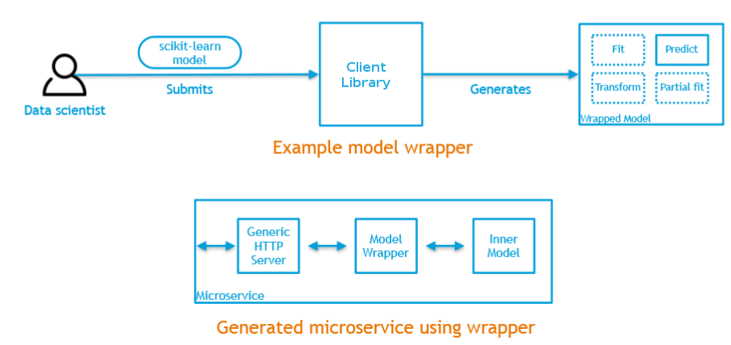

.. ===============LICENSE_START=======================================================
.. Acumos CC-BY-4.0
.. ===================================================================================
.. Copyright (C) 2017-2018 AT&T Intellectual Property & Tech Mahindra. All rights reserved.
.. ===================================================================================
.. This Acumos documentation file is distributed by AT&T and Tech Mahindra
.. under the Creative Commons Attribution 4.0 International License (the "License");
.. you may not use this file except in compliance with the License.
.. You may obtain a copy of the License at
..
.. http://creativecommons.org/licenses/by/4.0
..
.. This file is distributed on an "AS IS" BASIS,
.. WITHOUT WARRANTIES OR CONDITIONS OF ANY KIND, either express or implied.
.. See the License for the specific language governing permissions and
.. limitations under the License.
.. ===============LICENSE_END=========================================================

==========================
Model On-Boarding Overview
==========================

Acumos accommodates the use of a wide range of tools and  technologies in the development of machine learning models, including support for both open source and proprietary toolkits. Models can be easily onboarded and wrapped into containerized microservices which are interoperable with many other components. On-boarding provides an ingestion interface for various  types of models to enter the Acumos Machine Learning (ML) platform. Examples  of models include well-defined objects such as scikit-learn estimators, TensorFlow weights, and arbitrary R functions.

The solution for accommodating a myriad of different model types is to provide a custom wrapping library for each runtime. The client library encapsulates the complexity surrounding the serialization and deserialization of models. Additionally, the client library creates a common native interface, a wrapper, for invoking the inner model. In order for Acumos to be able to reason about models uniformly, there is a common model interface description that details what the available  model methods are and what they look like. Acumos instantiates ML models as microservices and safely composes them together.

Architecture
============
High-level flow:

In the illustrations below, custom transformation functions which consume and produce a native DataFrame are converted to standardized native models. The  transforms are then composed together in Acumos as microservices. This illustration begs the question of how the DataFrame can be  represented abstractly in order to validate this workflow.

.. image:: ../images/onboarding/UG_image3.png

.. image:: ../images/onboarding/UG_image4.png

.. image:: ../images/onboarding/UG_image5.png

Methods and Semantics
=====================

Acumos is a machine learning platform, thus we need to provide certain “methods” in our wrapped models that Acumos can invoke in order to support various workflows. In a machine learning setting, these methods might look like:

- fit(message) -> model state

    - Does a full “batch” fit, replacing previous internal model parameters
    - Returns a “model state” object that provides a standard serialization method

- partial_fit(message) -> model state

    - Does a partial fit, updating internal model parameters
    - Returns a “model state” object that provides a standard serialization method

- transform(message) -> message

    - Returns an object that provides a standard serialization method

On-Boarding Client Libraries
============================

The Acumos on-boarding process generates everything needed to create an executable microservice for your model and add it to the catalog.  Acumos uses Protobuf as a language-agnostic data format to provide a common description of the model data inputs and outputs.

Acumos support on-boarding Python, Java, and R models. The appropriate client library does the first step of the on-boarding process. This includes:

#) Introspection to assess the toolkit library versions and determine file types
#) Creation of a JSON description of the system
#) Creation of the protobuf file
#) File push to the Acumos on-boarding server
