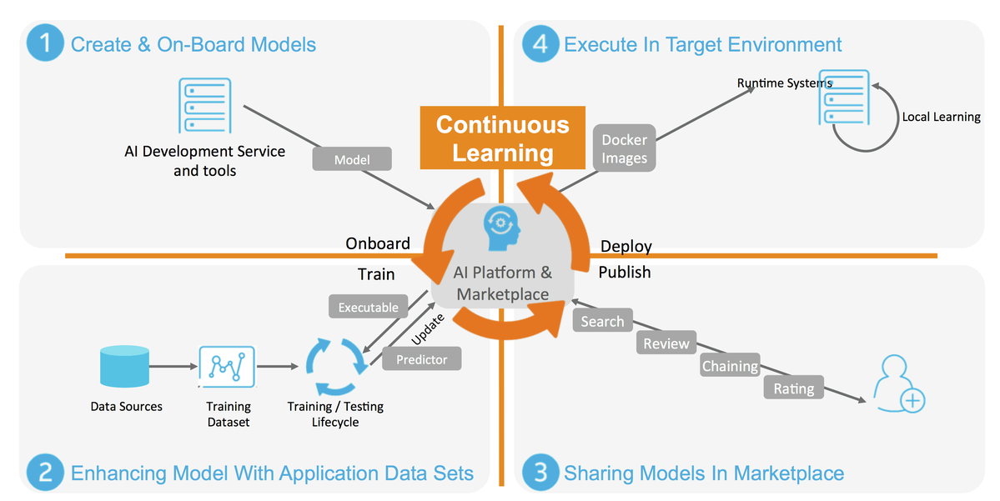

.. ===============LICENSE_START=======================================================
.. Acumos CC-BY-4.0
.. ===================================================================================
.. Copyright (C) 2017-2018 AT&T Intellectual Property & Tech Mahindra. All rights reserved.
.. ===================================================================================
.. This Acumos documentation file is distributed by AT&T and Tech Mahindra
.. under the Creative Commons Attribution 4.0 International License (the "License");
.. you may not use this file except in compliance with the License.
.. You may obtain a copy of the License at
..
.. http://creativecommons.org/licenses/by/4.0
..
.. This file is distributed on an "AS IS" BASIS,
.. WITHOUT WARRANTIES OR CONDITIONS OF ANY KIND, either express or implied.
.. See the License for the specific language governing permissions and
.. limitations under the License.
.. ===============LICENSE_END=========================================================

============
Introduction
============
.. this section should explain what the platform is

Acumos is a platform which enhances the development, training and deployment of AI models. Its purpose is to scale up the introduction of AI-based software across a wide range of industrial and commercial problems in order to reach a critical mass of applications. In this way, Acumos will drive toward a data-centric process for producing software based upon machine learning as the central paradigm. The platform seeks to empower data scientists to publish more adaptive AI models and shield them from the task of custom development of fully integrated solutions. Ideally, software developers will use Acumos to change the process of software development from a code-writing and editing exercise into a classroom-like code training process in which models will be trained and graded on their ability to successfully analyze datasets that they are fed. Then, the best model can be selected for the job and integrated into a complete application.

Acumos is not tied to any specific modeling language or toolkit and not limited to any one run-time infrastructure or cloud service. Acumos creates an open source mechanism for packaging, sharing, licensing and deploying AI models in the form of portable, containerized microservices and publishes them in a shared, secure catalog. Using Acumos, data scientists can build abstract AI models, using their favorite or most appropriates tools, which can be adapted to a variety of data formats, using data adaptation libraries, and formed into applications using a simplified chaining process. These models are intended to be used by IT professionals, who can integrate the models into practical applications, without a data science background or training in the various AI toolkits employed by the data scientists.

Acumos is intended to enable the use of a wide range of tools and technologies in the development of machine learning models including support for both open sourced and proprietary toolkits. Models can be easily onboarded and wrapped as containerized microservices which are interoperable with many other components.

Acumos provides a toolkit-independent App Store called a Marketplace for data-powered decision making and artificial intelligence software models. It provides a means to securely share AI microservices along with information on how they perform, such as ratings, popularity statistics and user-provided reviews to apply crowd sourcing to software development. The platform provides integration between model developers and applications in order to automate the process of user feedback, exception handling and software updates.

Acumos Design Studio can be used to chain together multiple models, along with data translation tools, filters and output adapters into a full end-to-end solution which can then be deployed into any run-time environment. The Acumos catalog contains information on the licensing and execution requirements of both reusable AI models and fully integrated solutions and this can be easily searched to make model selection a simple process.

Acumos' Data Broker provides capabilities for acquiring data from external sources, then using the data to train or tune models and retaining the data in order to provide retraining of future models.

The source code of the Acumos platform, itself, is available under an OSI-approved open source license so that any aspect can be readily adapted to new development toolkits, private data source and datastreams and custom run-time environments.

