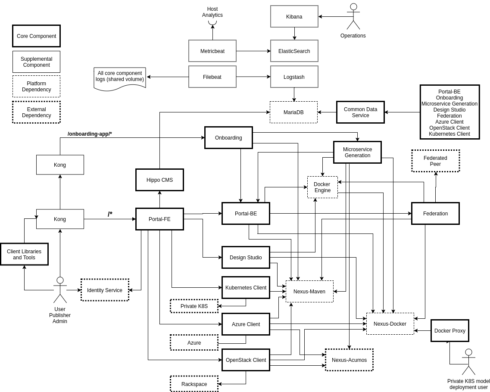

.. ===============LICENSE_START=======================================================
.. Acumos CC-BY-4.0
.. ===================================================================================
.. Copyright (C) 2017-2018 AT&T Intellectual Property & Tech Mahindra. All rights reserved.
.. ===================================================================================
.. This Acumos documentation file is distributed by AT&T and Tech Mahindra
.. under the Creative Commons Attribution 4.0 International License (the "License");
.. you may not use this file except in compliance with the License.
.. You may obtain a copy of the License at
..
.. http://creativecommons.org/licenses/by/4.0
..
.. This file is distributed on an "AS IS" BASIS,
.. WITHOUT WARRANTIES OR CONDITIONS OF ANY KIND, either express or implied.
.. See the License for the specific language governing permissions and
.. limitations under the License.
.. ===============LICENSE_END=========================================================

============
Architecture
============
.. topics to include:
.. diagram from wiki for an abstracted high level diagram for non-technical consumers
.. at least one entity-relationship diagram (classical architecture view)
.. reference points in the architecture and related APIs, at a high level
.. high-level description of each core component of the platform, and supporting
.. components: what they are, scope, role, how they interact/communicate, 
..   links to component guides
..     -- images/component-architecture-2017.png is outdated
.. images from wiki are in the images folder

Architecture Overview
=====================

.. image::  images/component-architecture-2017.png

Entity Relationships
====================

Interfaces and APIs
===================

External Interfaces and APIs
----------------------------

E1 - Toolkit Onboarding
.......................

E2 - Web APIs
.............

E3 - OA&M APIs
..............

E4 - Admin APIs
...............

E5 - Federation APIs
....................

E6 - Deployment APIs
....................

The Deployment subsystem primarily consumes APIs of external systems such as
cloud service environments, including Azure, OpenStack, and private kubernetes
clouds. The developer guides for the "Deployers" that coordinate model
deployment in those specific environments address the specific APIs consumed by
those Deployers. See the following for more information:

* `Acumos Azure Client <https://docs.acumos.org/en/latest/submodules/acumos-azure-client/docs/developer-guide.html>`_
* `Openstack Client <https://docs.acumos.org/en/latest/submodules/openstack-client/docs/developer-guide.html>`_
* `Kubernetes Client <https://docs.acumos.org/en/latest/submodules/kubernetes-client/docs/deploy-in-private-k8s.html>`_

Internal Interfaces and APIs
----------------------------

Common Data Service
...................

Hippo CMS
.........

Portal Backend
..............

Federation Gateway
..................

Microservice Generation
.......................

Security Verification
.....................

Azure Client
............

OpenStack Client
................

Kubernetes Client
.................

Component Logging
.................

ELK Stack
.........

Nexus
.....

Docker
......

Kong
....

Core Components
===============
.. high level description of the components and link to more info

The following sections describe the scope, role, and interaction of the core
Acumos platform components and component libraries. The sections are organized
per the Acumos project teams that lead development on the components.

Portal and User Experience
--------------------------

Portal Frontend
...............

Portal Backend
..............

Hippo CMS
.........

Model Onboarding
----------------

Onboarding App
..............

Java Client
...........

Python Client
.............

R Client
........

Design Studio
-------------

Design Studio Composition Engine
................................

Data Broker
...........

Runtime Orchestrator ("Model Connector")
........................................

Proto Viewer ("Probe")
......................

Deployment
----------

Azure Client
............

Openstack Client
................

Kubernetes Client
.................

Docker Proxy
............

Catalog, Data Model and Data Management
---------------------------------------

This project includes the Common Data Service, the Federation Gateway, and the Model Schema subprojects.

Common Data Service
...................

The Acumos Common Data Service provides a storage and query layer between Acumos system
components and a relational database.
The server component is a Java Spring-Boot application that provides REST service to callers
and uses Hibernate to manage the persistent store.
The client component is a Java library that provides business objects (models) and
methods to simplify the use of the REST service.

Federation Gateway
..................

The Federation Gateway component provides a mechanism to exchange models
between two Acumos instances via a secure network channel.  The Gateway is
implemented as a server that listens for requests on a REST API.  It also
has a client feature that communicates with remote instances.

Model Schema
............

The Model Schema is the JSON schema used to define and validate the Acumos model metadata generated by client libraries
such as the Acumos python client library.

Common Services
---------------

Microservice Generation
.......................

Nexus Client
............

Generic Model Runner
....................

Python DCAE Model Runner
........................

Security Verification
.....................

Supporting Components
=====================
.. high level description of the components and link to more info

The following sections describe the scope, role, and interaction of supporting
Acumos platform components and tools.

Operations, Admin, and Maintenance (OAM)
----------------------------------------

System Integration
..................

Filebeat
........

Metricbeat
..........

ELK Stack
.........

Other Supporting Components
---------------------------

MariaDB
.......

Nexus
.....

Kong
....

Docker-CE
.........

Kubernetes
..........
