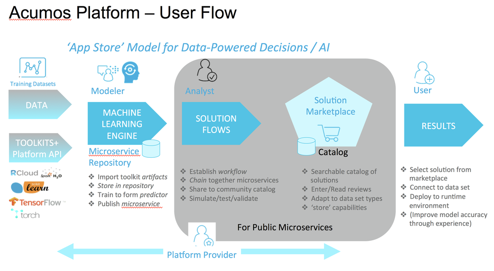
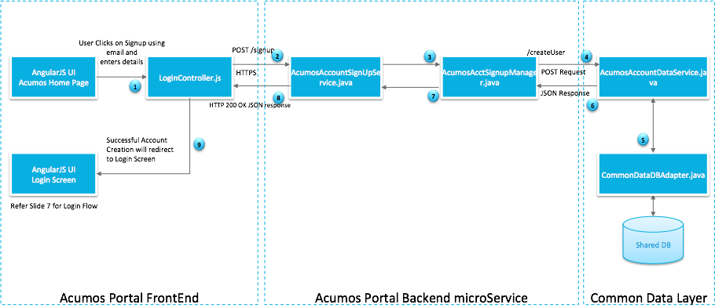
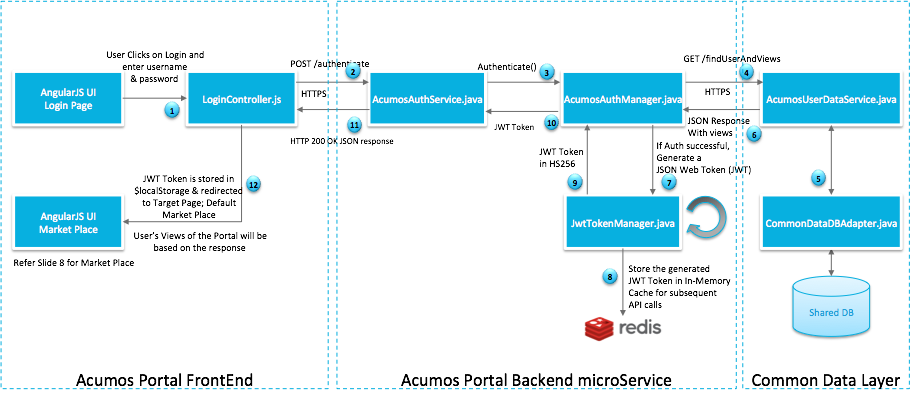
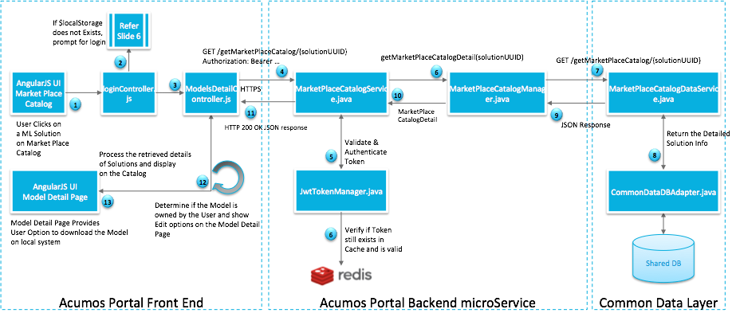
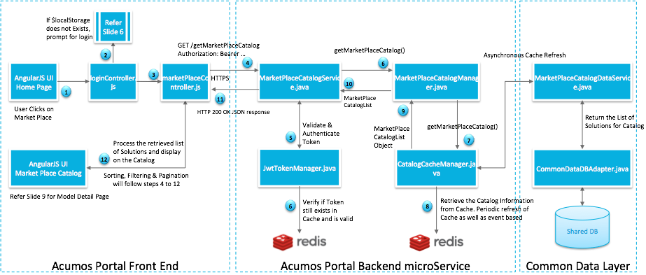
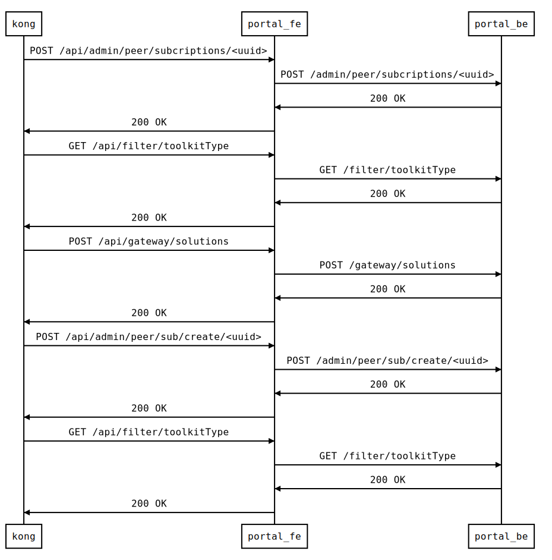
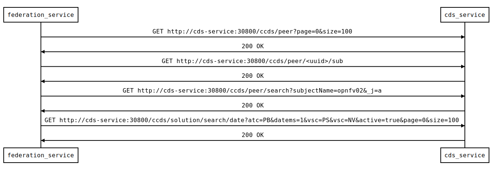

.. ===============LICENSE_START=======================================================
.. Acumos CC-BY-4.0
.. ===================================================================================
.. Copyright (C) 2017-2018 AT&T Intellectual Property & Tech Mahindra. All rights reserved.
.. ===================================================================================
.. This Acumos documentation file is distributed by AT&T and Tech Mahindra
.. under the Creative Commons Attribution 4.0 International License (the "License");
.. you may not use this file except in compliance with the License.
.. You may obtain a copy of the License at
..
.. http://creativecommons.org/licenses/by/4.0
..
.. This file is distributed on an "AS IS" BASIS,
.. WITHOUT WARRANTIES OR CONDITIONS OF ANY KIND, either express or implied.
.. See the License for the specific language governing permissions and
.. limitations under the License.
.. ===============LICENSE_END=========================================================

=============
Platform Flow
=============

User Journeys
-------------

Following are some illustrative "user journey" diagrams for common Acumos
workflows.

Acumos Platform User Flow
.........................

Acumos User Signup Flow
.......................

Acumos User Login Flow
......................

Component Interaction
---------------------

Following are some illustrative diagrams for common Acumos component interactions.

Acumos Model Detail Flow
........................

Acumos Catalog Flow
...................

Inter-Component Message Flows
-----------------------------

Following are some actual message flows between Acumos components. Some
URI parameters have been abstracted to reduce the complexity of the flows.
You can click on the flows to view them in native SVG form, which makes it
easier to resize, scroll around, etc.

Web Onboarding
..............

This flow shows a typical web onboarding sequence. 

CLI Onboarding
..............

This flow shows a typical web onboarding sequence. 

Model Publishing
................

This flow shows a typical model publishing sequence. 

Request for Published Solution Subscription, at Subscribing Platform
....................................................................

This flow shows the processing of a request for subcription to a solution
published by a peer platform, at the subscribing platform. Note that
some subsquent actions to these steps are not shown in this flow version, e.g.
retrieval of the artifacts for the subscribed solution.

Request for Published Solution Subscription, at Publishing Platform
...................................................................

This flow shows the processing of a request for subcription to a solution
published by a platform, when received at the publishing platform. Note that
some subsquent actions to these steps are not shown in this flow version, e.g.
retrieval of the artifacts for the subscribed solution.

