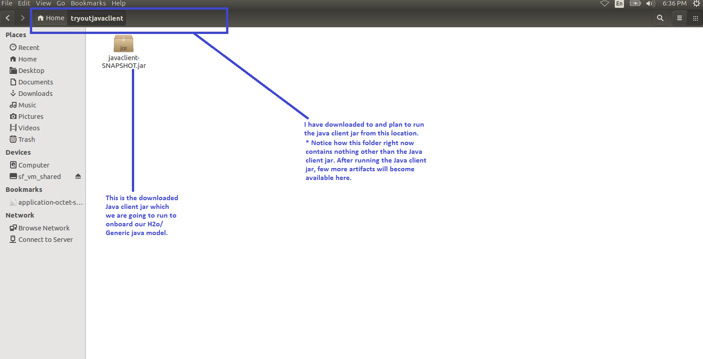
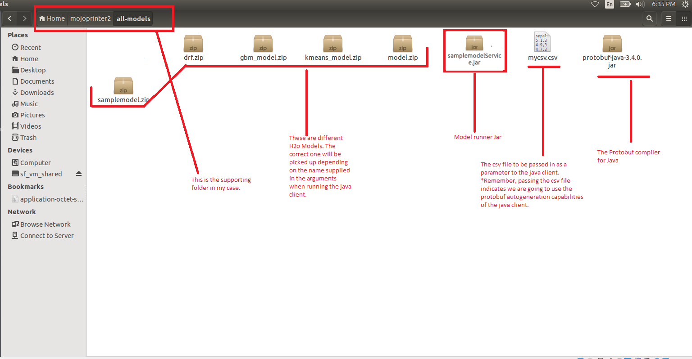
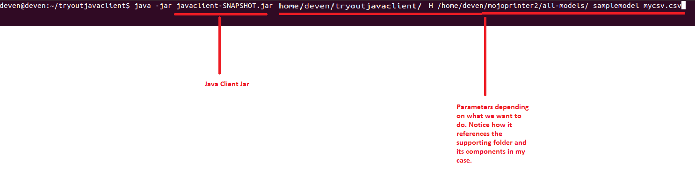
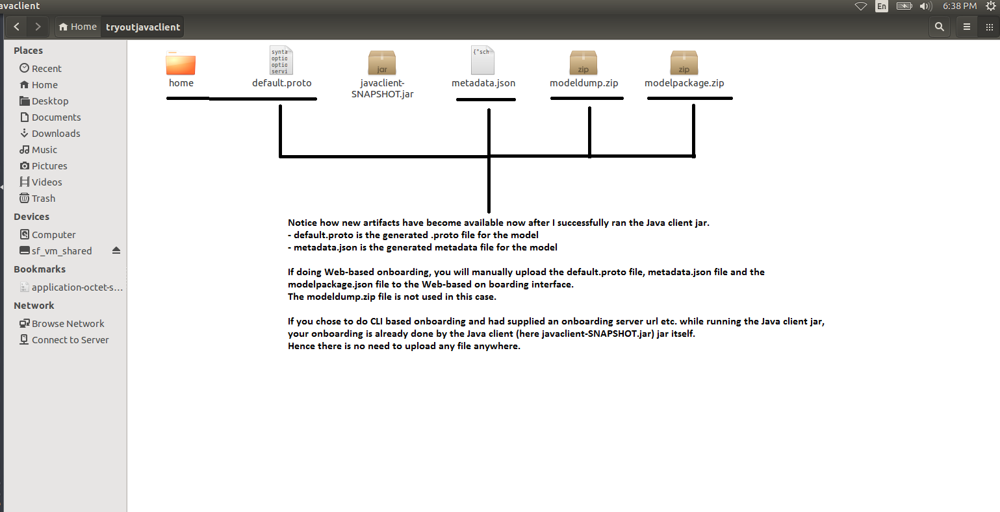

.. ===============LICENSE_START=======================================================
.. Acumos
.. ===================================================================================
.. Copyright (C) 2017-2018 AT&T Intellectual Property & Tech Mahindra. All rights reserved.
.. ===================================================================================
.. This Acumos documentation file is distributed by AT&T and Tech Mahindra
.. under the Creative Commons Attribution 4.0 International License (the "License");
.. you may not use this file except in compliance with the License.
.. You may obtain a copy of the License at
.. 
..      http://creativecommons.org/licenses/by/4.0
.. 
.. This file is distributed on an "AS IS" BASIS,
.. WITHOUT WARRANTIES OR CONDITIONS OF ANY KIND, either express or implied.
.. See the License for the specific language governing permissions and
.. limitations under the License.
.. ===============LICENSE_END=========================================================

.. _java-client-guide-top:

=============================
Acumos Java Client User Guide
=============================
 
Overview
========
- It is 1 part of the Acumos Tools for H2o.ai and Generic Java models.
- The Java client (https://gerrit.acumos.org/r/acumos-java-client) is a command line utility that the Modeller/Onboarder/ ML expert/Data Scientist runs on his local machine or wherever he has the model to onboard it into Acumos.
- Both of them together provide a way to use H2o.ai and Generic Java in the Acumos Platform. 

 
 
Architecture and Design
=======================

----------
Java Client Library (https://gerrit.acumos.org/r/acumos-java-client):
----------
Allows the H2o or Generic Java model and other artifacts to become available in the onboarding server for the H2o Model runner to be able to use them.

- The Modeller/Onboarder/ ML expert/Data Scientist creates his model in H2o and exports it in the MOJO model format (.zip file) using any interface (eg.Python, Flow, R) provided by H2o
- For Generic Java, the Modeller/Onboarder/ ML expert creates his model and exports it in the .jar format.
- He runs the JavaClient jar, which creates a Protobuf (default.proto) file for the Model, creates the required metadata.json file and an artifact called modelpackage.zip.
- Depending on the choice of the modeler, he can manually upload these generated artifacts to the Acumos Marketplace via its Web interface. This is Web-based onboarding. We will see how to do this in this article.
- Or the Java client library itself, onboards the model onto the onboarding server if the modeler provides the onboarding server URL. This is CLI-based onboarding. We will also see how to do this in this article.

----------
Model Runner (https://gerrit.acumos.org/r/generic-model-runner):
----------
 Allows the onboarded Model to be run as containerized microservice and allows other external applications to use the onboarded Model for predictions.

- Essentially, provides a wrapper around the ML model, packages it as a containerized microservice and exposes a predict method as a rest endpoint.
- When the model is onboarded and deployed, this method (REST endpoint) can then be called by other external applications to request predictions off of the model.

     
Technology and Frameworks
=========================

- Languages: Java
- Other Technologies: Google Protocol buffers, H2o.ai
- Frameworks: Junit.
 
 
Project Resources
=================
- Gerrit repo: https://gerrit.acumos.org/r/acumos-java-client
- `Jira <https://jira.acumos.org>`_  acumos-java-client

Development Setup
=================
---------- 
For the Modeller/Onboarder/ ML expert/Data Scientist:
----------
You will need the jars from the above 2 projects:

You can download the Java Client (ie. executable jar for https://gerrit.acumos.org/r/acumos-java-client project) from Nexus. 
Go to https://nexus.acumos.org/#nexus-search;quick~java-client and download the latest version of the Java client jar.

You can download the h2o-genericjava-modelrunner (ie. executable jar for https://gerrit.acumos.org/r/generic-model-runner project) from Nexus. 
Go to https://nexus.acumos.org/#nexus-search;quick~runner and download the latest version of the h2o-genericjava-modelrunner jar.

You must have the following installed on your machine-

----------
For the Modeller/Onboarder/ ML expert/Data Scientist:
----------
- Java 1.8

 

How to Run
==========
----------
Preparing to Onboard your H2o or a Generic Java Model:
----------
a. Place JavaClient.jar in one folder locally. This is the folder from which you intend to run the jar. After the jar runs, the created artifacts will also be available in this folder. You will use some of these artifacts if you are doing Web-based onboarding. We will see this later.

b. Create an additional supporting folder which will contain all that the JavaClient.jar needs to run. It will contain-

i) Models - In case of H2o, your model will be a MOJO zip file. In case of Generic Java, your model will be .jar file. We have included sample models for you to play around with.
ii) Protobuf compiler for java version 3.4.0 - Download protobuf-java-3.4.0.jar from http://central.maven.org/maven2/com/google/protobuf/protobuf-java/3.4.0/ and place it in this folder.
iii) Model runner or Service jar - Rename h2o-genericjava-modelrunner.jar obtained from the 1st section to abcService.jar if your model name is abc. Place it in this folder. NOTE: For Generic Java, this is placed in the same folder as Java Client jar.

iv) csv file used for training the model - Place the csv file (with header having the same column names used for training) you used for training the model here. This is used for autogenerating the .proto file. If you don't have the .proto file, you will have to supply the .proto file yourself in the supporting folder. Make sure you name it default.proto
v) default.proto - This is only needed if you don't have the csv file used to train the model. In this case, Java Client cannot autogenerate the .proto file. You will have to supply the .proto file yourself in the supporting folder. Make sure you name it default.proto Also make sure, 
the default.proto file for the model is in the following format. You need to appropriately replace the data and datatypes under DataFrameRow and Prediction according to your model.
.. code-block::

   syntax = "proto3";
   option java_package = "com.google.protobuf";
   option java_outer_classname = "DatasetProto";
   
   message DataFrameRow {
   string sepal_len = 1;
   string sepal_wid = 2;
   string petal_len = 3;
   string petal_wid = 4;
   }
   message DataFrame {
        repeated DataFrameRow rows = 1;
   }
   message Prediction {
        repeated string prediction= 1;
   }
   
   service Model {
     rpc transform (DataFrame) returns (Prediction);
   }

vi) ModelConfig.properties : Only needed if you are onboarding a Generic Java model.

----------
Onboarding your model
----------

JavaClient.jar is the executable client jar file.

For Web-based onboarding of H2o models, the parameters to run the client jar are: 

1. Current Folder path : Full folder path in which Java client jar is placed and run from. 
2. Model Type for H2o : H 
3. Supporting folder path : Full Folder path of the supporting folder which contains items 
4. Name of the model : For h2o just the name of the model without the .zip extension. Make sure this matches name of the supplied MOJO model file exactly.
5. Input csv file : csv file that was used for training the model. Include the .csv extension in the csv file name. This will be used to autogenerate the default.proto file. This parameter will be empty if you yourself have supplied a default.proto for your model.

For CLI-based onabording of H2o models, the parameters to run the client jar are: 

1. Onboarding server url
2. Model Type for H2o : H 
3. Supporting folder path : Full Folder path of the supporting folder which contains items 
4. Name of the model : For h2o just the name of the model without the .zip extension. Make sure this matches name of the supplied MOJO model file exactly.
5. Username
6. Password
7. Input csv file : csv file that was used for training the model. Include the .csv extension in the csv file name. This will be used to autogenerate the default.proto file. This parameter will be empty if you yourself have supplied a default.proto for your model.

----------
Example onboarding and folder structure:
----------
1. I place my Javaclient.jar in /home/deven/tryoutjavaclient/ folder. This is where I intend to run the jar from. After the jar runs, the created artifacts will also be available in this folder.

|image0|

2. I prepare a supporting folder /home/deven/mojoprinter2/all-models like so. It has everything I need to onboard my java model.
In this case, I am onboarding samplemodel.zip which is a K-means Clustering H2o model which does partitioning of a large calls dataset.

|image1|

3. I intend to do Web-based onboarding for my H2o model called samplemodel.zip. And I intend to use the proto file autogeneration capabilities of the Java client.
So I also pass along the csv file I used to train it. The sample command looks like this-

|image2|

4. Now I go back to /home/deven/tryoutjavaclient/ (i.e from where I ran the Java client) to find the generated artifacts. I will now manually upload the metadata.json file, modelpackage.zip and the default.proto file to the web interface of the marketplace.

|image3|

 
How to Test
===========
mvn test

----------
What happens after onboarding?
----------
- You will be able to get a success message if your model was onboarded successfully. If you use Web-based onboarding, you will be able to see a success method in the Web interface. If you use CLI based onboarding, you will see a message on the terminal that tells it was onboarded succesfully.
- The needed TOSCA artifacts, docker images are produced and the model is published to the marketplace.
- You and your teammates can now see, rate, review, comment, collaborate on your model in the Acumos marketplace.
- When requested and deployed by a user, your model runs as a docker containerised microservice on the infrastructure of your choice and exposes a predict method as a rest endpoint.
- This method can be called by other external applications to request predictions off of your model.

----------
Addendum : Creating a model in H2o:
----------
You must have H2o 3.14.0.2 installed on your machine. For instructions on how to install visit https://www.h2o.ai/download/

H2o provides different interfaces to create models and use H2o for eg. Python, Flow GUI, R, etc.
As an example, below we show how to create a model using the Python innterface of H2o and also using the H2o Flow GUI. You can use the other interfaces too which have comparable functions to train a model and download the model in a MOJO format.

#### Here is a sample H2o iris example program that shows how a model can be created and downloaded as a MOJO using the Python Interface 
  
  

.. code-block:: python

   import h2o
   import pandas as pd
   import numpy as np
   import matplotlib.pyplot as plt
   import seaborn as sns
   
   # for jupyter notebook plotting,
   %matplotlib inline
   sns.set_context("notebook")
   
   h2o.init()
   
   # Load data from CSV
   iris = h2o.import_file('https://raw.githubusercontent.com/h2oai/h2o-3/master/h2o-r/h2o-package/inst/extdata/iris_wheader.csv')
   
   Iris data set description
   -------------------------
   1. sepal length in cm
   2. sepal width in cm
   3. petal length in cm
   4. petal width in cm
   5. class:
       Iris Setosa
       Iris Versicolour
       Iris Virginica
   
   
   iris.head()
   iris.describe()
   # training parameters
   training_columns = ['sepal_len', 'sepal_wid', 'petal_len', 'petal_wid']
   #  response parameter
   response_column = 'class'
   
   # Split data into train and testing
   train, test = iris.split_frame(ratios=[0.8])
   train.describe()
   test.describe()
   
   from h2o.estimators import H2ORandomForestEstimator
   model = H2ORandomForestEstimator(ntrees=50, max_depth=20, nfolds=10)
   
   # Train model
   model.train(x=training_columns, y=response_column, training_frame=train)
   
   print (model)
   
   # Model performance
   performance = model.model_performance(test_data=test)
   print (performance)
   
   # Download the model in MOJO format. Also download the h2o-genmodel.jar file
   modelfile = model.download_mojo(path="/home/deven/Desktop/", get_genmodel_jar=True)
   
   predictions=model.predict(test)
   predictions

Here is a sample H2o iris example program that shows how a model can be created and downloaded as a MOJO using the H2o Flow GUI.
 
 |image4|

 |image5|

 |image6|

 |image7|

 |image8|
 

.. |image4| image:: ./images/java-client/1.png
.. |image5| image:: ./images/java-client/2.png
.. |image6| image:: ./images/java-client/3.png
.. |image7| image:: ./images/java-client/4.png
.. |image8| image:: ./images/java-client/5.png
