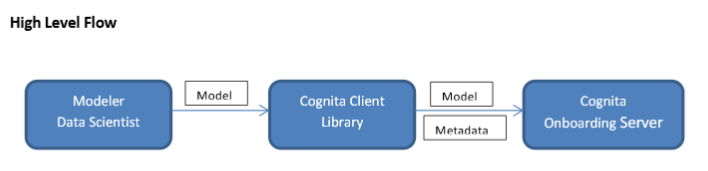
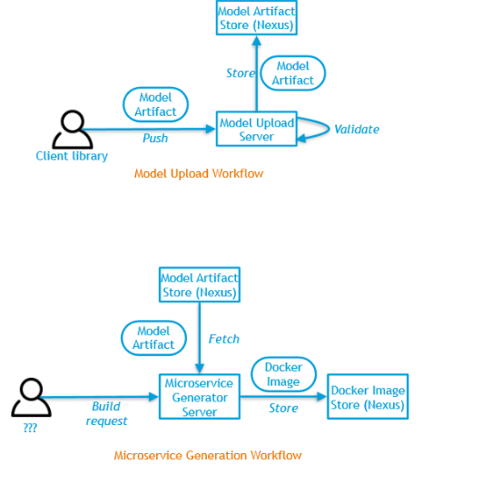
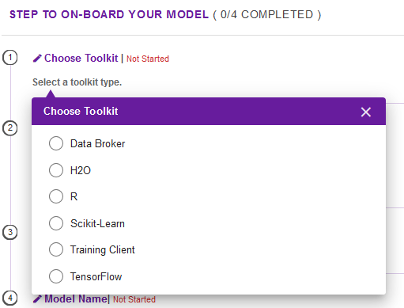
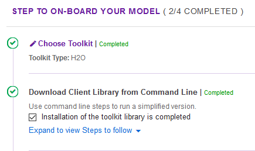
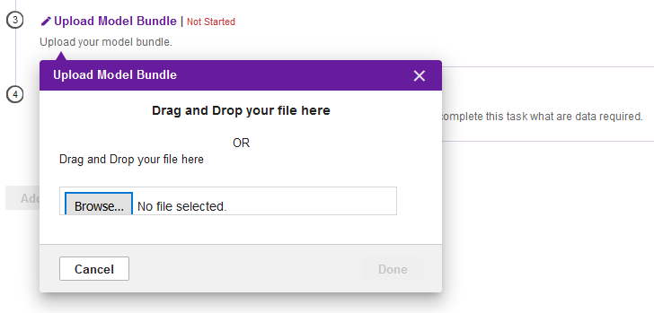
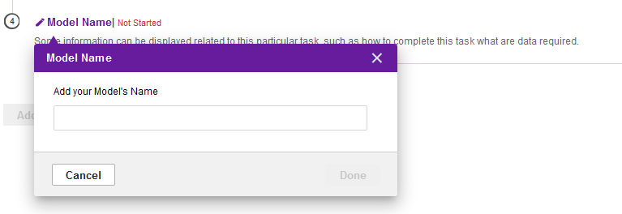

.. ===============LICENSE_START=======================================================
.. Acumos CC-BY-4.0
.. ===================================================================================
.. Copyright (C) 2017-2018 AT&T Intellectual Property & Tech Mahindra. All rights reserved.
.. ===================================================================================
.. This Acumos documentation file is distributed by AT&T and Tech Mahindra
.. under the Creative Commons Attribution 4.0 International License (the "License");
.. you may not use this file except in compliance with the License.
.. You may obtain a copy of the License at
..
.. http://creativecommons.org/licenses/by/4.0
..
.. This file is distributed on an "AS IS" BASIS,
.. WITHOUT WARRANTIES OR CONDITIONS OF ANY KIND, either express or implied.
.. See the License for the specific language governing permissions and
.. limitations under the License.
.. ===============LICENSE_END=========================================================
======================
On-Boarding User Guide
======================

1. Introduction
---------------

**This is the User guide for Onboarding.**

**1.1 What is Onboarding ?**

Acumos is intended to enable the use of a wide range of tools and
technologies in the development of machine learning models including
support for both open sourced and proprietary toolkits. Models can be
easily onboarded and wrapped into containerized microservices which are
interoperable with many other components.

The goal of Onboarding is to provide an ingestion interface for various
types of models to enter the acumos machine learning platform. Examples
of models include well-defined objects such as scikit-learn estimators,
TensorFlow weights, and arbitrary R functions.

The solution for accommodating a myriad of different model types is to
provide a custom wrapping library for each runtime. The wrapper will
encapsulate the complexity surrounding the serialization and
deserialization of models. Additionally, the wrapper will provide a
common native interface for invoking the inner model. In order for
acumos to be able to reason about models uniformly, there will also have
to be a common model interface description. E.g. what are the available
model methods, and what do they look like? One goal of acumos is to
instantiate ML models as microservices and safely compose them together.
We must collect enough model metadata to enable this.

In short, our goals are to:

- Create wrapper libraries that can serialize/deserialize models and provide a standard native interface

- Represent model I/O such that Acumos can generate microservices and validate connections between them.

**1.2 Target Users**

This guide is targeted towards the open source user community that:

1. Intends to understand the backend functionality of the Onboarding.

2. Intends to contribute code to enhance the functionality of the
Onboarding.

2. Technology & Framework Used
------------------------------

Technology and Framework used are as follows:

-  Java 1.8

-  Spring Boot

-  Spring REST

-  Docker Java Library

3. Onboarding Architecture & APIs
---------------------------------

**3.1 Onboarding High Level Architecture**

Below is the High Level Architecture for Onboarding

|image0|

Modeler/Data scientist creates model using toolkit. Modeler uses
Acumos-client-library to push the model to Acumos platform. The client
library uploads model and metadata file to Acumos onboarding
server.Onboarding server creates docker image of model and push to nexus
docker registry.It also creates solution, puts model and metadata
artifact to repository.

|image1|

The modeller will create model using various technologies (toolkits) and
use the acumos client library to upload model to platform.Acumos
Onboarding server exposes REST interface, which is used by client
library for uploading the model to platform.

**3.2 Onboarding Backend APIs**

-**OnboardingWithAuthentication:-**

This API provides the basic authentication prior to Onboard any model.

-**dockerizePayload**:-

This API is used for actual Onboarding the Models.

It gets invoked after the successful authentication.

4. Onboarding Methods,Semantics & Model Requirements
----------------------------------------------------

**4.1 Onboarding Methods and Semantics**

Acumos is a machine learning platform, thus we need to provide certain
“methods” in our wrapped models that Acumos can invoke in order to
support various workflows. In a machine learning setting, these methods
might look like:

- fit(message) -> model state

- Does a full “batch” fit, replacing previous internal model parameters.

- Returns a “model state” object that provides a standard serialization method.

- partial_fit(message) -> model state

- Does a partial fit, updating internal model parameters.

- Returns a “model state” object that provides a standard serialization method.

- transform(message) -> message

- Returns an object that provides a standard serialization method.

Notes:

- We may choose to combine fit and partial_fit,and provide fit a flag such as partial=True or similar.

- Wrapped models can provide any number of additional functions, but they will not be semantically meaningful to Acumos.

- The microservice wrapper may choose to expose additional APIs that are compositions of these methods.

- For example,/api/partialFitTransform may invoke partial_fit,persist the model, and return the transformed data.

**4.2 Onboarding Model Wrapper Requirements**

1.Model wrapper must provide an abstract API that supports the fit, partial_fit,and transform methods.

- This abstract API will be invoked by the transport-layer application.

2.The fitand partial_fitmethods must accept a Protobuf message and
return a custom “Model State” object that can be serialized and
deserialized.

- The Model State should provide an abstract serialize/deserialize API that is subclassed by concrete applications.

- The Model State provides a way to persist or checkpoint models.

3.The transform method must accept a Protobuf message and return a
Protobuf message.

4.Model wrapper must be able to serialize itself to a file.

- The file can contain anything the wrapper needs to deserialize itself.

- E.g. it could be a zip file containing binaries, custom metadata, etc.

5.Model wrapper must provide functionality to deserialize a wrapped
model from file for native use.

- The transport-layer application would use this API to initially load the model.

- E.g. provide a static function.

**4.3 Onboarding Client Library Requirements**

1.The client library must be able to produce a serialized wrapped model.

2.The client library must be able to produce a valid model metadata file
version 0.2.0

- https://acumos.atlassian.net/wiki/display/CW/E1+Model+Design

3.The client library must generate new Protobuf files with unique
package names for custom data types.

4.The client library must upload the serialized wrapped model, model
metadata file, and any new defined message types to the model upload
server.

**4.4 Onboarding Metadata Requirements**

1.Each technology owner must create a jsonschema which validates the
“runtime” object of the model metadata.

- Refer to https://acumos.atlassian.net/wiki/display/CW/E1+Model+Design

- The runtime metadata is used to generate a Docker image with appropriate dependencies installed.

**4.5 Public Model Metadata**

Each model type must provide the same public metadata. The runtime
dependencies will depend on the implementation, but there will still be
standardized schemas for Python, Java, R, etc. One breakdown may look
like:

- Models

- Methods

- I/O specification

- Parameters - e.g. runtime configurable options, or partially applied functions

- Runtime

- Dependencies - e.g. Python requirements.txt or Java pom.xml

- Deployment hints - e.g. # of CPUs, RAM

5. Onboarding Use Case Illustration & Data Formats
--------------------------------------------------

**5.1 Onboarding Use Case Illustration**

Below, custom transformation functions which consume and produce a
native DataFrame are converted to standardized native models. The
transforms are then composed together in Acumos as microservices.

This illustration begs the question of how the DataFrame can be
represented abstractly in order to validate this workflow.

|image2|

|image3|

|image4|

**5.2 Method Description: Data Formats**

Acumos must be able to generate microservices and validate microservice
compositions. Thus models must provide sufficient metadata to enable
both. A major challenge is representing native data structures
abstractly.

The current solution is to use existing web standards to represent data
while avoiding specifying the underlying transport.

We can use three tiers of specification:

- Media type (e.g. application/json, image/png, video/mp4, etc.)

- If media type is application/json, require a reference to public and frozen jsonschema

- If media type is application/json, optionally allow a “format” which provides additional information

Notes

- An alternative to this approach may be using popular serialization tools such as Protobuf or Avro

**5.3 Method Description: Data Formats: DataFrame**

Let’s consider the DataFrame, a common data structure in machine
learning, as an example. The DataFrame is a complex data structure; it
can contain any number of columns and each column can be a different
data type. How can the two functions below be used together?

The DataFrame structure can be abstractly represented using a schema
like jsonschema. The schema might define an object with a variable
number of homogenous columns. However how do you differentiate a
DataFrame with 3 float columns from a DataFrame with 4 float columns?
Creating a new schema for each variant of DataFrame would result in an
explosion of schemas.

By specifying an additional piece of schema-specific information, called
the format, we can completely specify the input. For example, the 3
float column DataFrame might be represented with:

- media type: “application/json”

- schema: “acumos.research.att.com/schema/types/DataFrame/v1”

- format: {“columns”: 3, “types”: “float”, “names”: null}

- Or {“columns”: [“float”, “float”, “float”], “names”: [“foo”, “bar”, “baz”]} i.e. multiple schemas can be valid

Notes

- The format would have its own schema, which is co-located with and corresponds to the DataFrame schema.

- E.g. the format schema would exist at acumos.research.att.com/schema/types/DataFrame/v1/format

- While we are using jsonschema to abstractly represent data structures, we do not wish to be married to a particular serialization method.  Ideally we should have enough information to generate specifications for other tools, e.g. Protobuf.

import pandas as pd

def py_func(df: pd.DataFrame) -> pd.DataFrame:

...

import com.foobar.DataFrame;

public DataFrame javaFunc(DataFrame df) {

...

}

6. Docker Image Creation Process Details
----------------------------------------

The onboarding server exposes REST API for model and metadata upload.

The metadata JSON is validated for valid schema using JSON schema
validator.

The model metadata is used to get the runtime version information, for
example python 2.7.This information is used to fetch the runtime
template. The runtime template contains template for following files:

1.Dockerfile

2.requirements.txt

3.app.py

4.swagger.yaml

The above template files are populated based on metadata JSON uploaded
by user.

Onboarding server uses docker-java library for model docker image
creation. Once the docker image is created, the image is tagged and
pushed to nexus docker registry.

The server uses common data micro-services API to create solution and
store model and metadata to

artifact repository.

7. Model Validation Workflow
----------------------------

Following steps needs to be executed as part of model validation
workflow:

-  Onboarding server will expose an REST API for validating the model.  The REST API will take solutionID and metadata JSON containing model features as input parameters.

-  The server will fetch the docker image details for the corresponding solution and run the model image.

-  The input metadata JSON features will be send to predict API exposed by model docker image and output of predict method will be returned as API output.

8. Onboard any Model By Command line or Web Based Onboarding
------------------------------------------------------------

The Acumos on-boarding process generates everything needed to create an
executable microservice for your model and add it to the catalog. Acumos
uses Protobuf as a language-agnostic data format to provide a common
description of the model data inputs and outputs.

The client library does the first step of the on-boarding process. This
includes: (1) introspection to assess the toolkit library versions and
determine file types, (2) creation of a json description of the system
(3) creation of the protobuf file, (4) file push to the Acumos
on-boarding server.

Once your model is on-boarded, it will available in the PRIVATE section
of the Acumos Marketplace. Tools to manage and publish your model are
available in the Acumos Portal.

We have to ways to Onboard any Model:

**1. On-Boarding By Command line:**

**2. On-Boarding By Web**

1. **On-Boarding By Command line:**

    Follow the below steps to perform Command based Onboarding for
    Models Likes H20,TensorFlow,Scikit Learn,R,Java.

Onboarding H20 Model by Command Line:

-------------------------------------

This toolkit generates everything to create an executable Acumos
microservice around H2o models.

Getting Started

The H2o model is exported in the MOJO model format (.zip file) using any
interface (eg.Python, Flow, R) provided by H2o. To on-board your model,
you need to download the h2o-genmodel.jar file using any interface
(eg.Python, Flow, R) provided by H2o. At present, the common data format
conversion is done in the modeler's local enviornment, so the protoc application is also required.

Before you begin

- We assume you have H2o 3.14.0.2 installed on your machine. If not please take a look at https://www.h2o.ai/download/

- You must have protobuf 3 installed. Please visit the protobuf repository for more information on how to install protoc. Install version 3 (version 2 will not work).

- Your on-boarding url is: XYZ

Installation:

- install protoc

- get client libraries

- Package Model and Push to Acumos

Usage

- Iris example and screen shots

Testing

Creating a model in H2o:

H2o provides different interfaces to create models and use H2o. As an
example, below we show how to create a model using the Python interface
of H2o and also using the H2o Flow GUI. You can use the other interfaces
too which have comparable functions to train a model and download the
model in a MOJO format.

#### Here is a sample H2o iris example program that shows how a model
can be created and downloaded as a MOJO using the Python Interface
.. code-block:: python
   
   import h2o
   
   import pandas as pd
   
   import numpy as np
   
   import matplotlib.pyplot as plt
   
   import seaborn as sns
   
   # for jupyter notebook plotting,
       matplotlib inline
   
   sns.set_context("notebook")
   
   h2o.init()
   
   # Load data from CSV
   
   iris =
   h2o.import_file('https://raw.githubusercontent.com/h2oai/h2o-3/master/h2o-r/h2o-package/inst/extdata/iris_wheader.csv')
   
   Iris data set description
   
   
   
   1. sepal length in cm
   
   2. sepal width in cm
   
   3. petal length in cm
   
   4. petal width in cm
   
   5. class:
   
   Iris Setosa
   
   Iris Versicolour
   
   Iris Virginica
   
   iris.head()
   
   iris.describe()
   
   # training parameters
   
   training_columns = ['sepal_len', 'sepal_wid', 'petal_len', 'petal_wid']
   
   # response parameter
   
   response_column = 'class'
   
   # Split data into train and testing
   
   train, test = iris.split_frame(ratios=[0.8])
   
   train.describe()
   
   test.describe()
   
   from h2o.estimators import H2ORandomForestEstimator
   
   model = H2ORandomForestEstimator(ntrees=50, max_depth=20, nfolds=10)
   
   # Train model
   
   model.train(x=training_columns, y=response_column, training_frame=train)
   
   print (model)
   
   # Model performance
   
   performance = model.model_performance(test_data=test)
   
   print (performance)
   
   # Download the model in MOJO format. Also download the h2o-genmodel.jar
   file
   
   modelfile = model.download_mojo(path="/home/deven/Desktop/",
   get_genmodel_jar=True)
   
   predictions=model.predict(test)
   
   predictions

2. **On-Boarding By Web:**

We can Onboard the models using Web based Onboarding:

Following are the steps for Web based Onboarding:

Step 1. Choose Toolkit:

To Onboard any model select the Toolkit i.e. the model you want to
Upload like H20,TenosrFlow,R,Scikit-Learn,etc.

After selecting the Toolkit it will show you the Toolkit name which you
have selected in first Step.

|image5|

Step2. Download Client Library from Command Line:

In second step it’ll download it will download all the client library
for Onboarding the Model.

You can tick the checkbox so that Installation of the toolkit library is
completed.

|image6|

You can also Expand to view Steps to follow:

**H2o Model:**

This toolkit generates everything to create an executable Acumos
microservice around H2o models.

Getting Started

-------------------------------------------------------------------------------------------------------------------

The H2o model is exported in the MOJO model format (.zip file) using any
interface (eg.Python, Flow, R) provided by H2o. To on-board your model,
you need to download the h2o-genmodel.jar file using any interface
(eg.Python, Flow, R) provided by H2o. At present, the common data format
conversion is done in the modeler’s local enviornment, so the protoc
application is also required.

**Before you begin**

--------------------------------------------------------------------------------------------------------------------

- We assume you have H2o 3.14.0.2 installed on your machine. If not please take a look https://www.h2o.ai/download/

- You must have protobuf 3 installed. Please visit the protobuf repository for more information on how to install protoc. Install version 3 (version 2 will not work).

- Your on-boarding url is: XYZ

**Installation**

--------------------------------------------------------------------------------------------------------------------

- install protoc

- get client libraries

- Package Model and Push to acumos

Usage

--------------------------------------------------------------------------------------------------------------------

- Iris example and screen shots

Testing

--------------------------------------------------------------------------------------------------------------------

Creating a model in H2o:

--------------------------------------------------------------------------------------------------------------------

H2o provides different interfaces to create models and use H2o. As an
example, below we show how to create a model using the Python innterface
of H2o and also using the H2o Flow GUI. You can use the other interfaces
too which have comparable functions to train a model and download the
model in a MOJO format.

#### Here is a sample H2o iris example program that shows how a model
can be created and downloaded as a MOJO using the Python Interface

import h2o

import pandas as pd

import numpy as np

import matplotlib.pyplot as plt

import seaborn as sns

# for jupyter notebook plotting,

%matplotlib inline

sns.set_context("notebook")

h2o.init()

# Load data from CSV

iris =
h2o.import_file('https://raw.githubusercontent.com/h2oai/h2o-3/master/h2o-r/h2o-package/inst/extdata/iris_wheader.csv')

Iris data set description

-------------------------

1. sepal length in cm

2. sepal width in cm

3. petal length in cm

4. petal width in cm

5. class:

Iris Setosa

Iris Versicolour

Iris Virginica

iris.head()

iris.describe()

# training parameters

training_columns = ['sepal_len', 'sepal_wid', 'petal_len', 'petal_wid']

# response parameter

response_column = 'class'

# Split data into train and testing

train, test = iris.split_frame(ratios=[0.8])

train.describe()

test.describe()

from h2o.estimators import H2ORandomForestEstimator

model = H2ORandomForestEstimator(ntrees=50, max_depth=20, nfolds=10)

# Train model

model.train(x=training_columns, y=response_column, training_frame=train)

print (model)

# Model performance

performance = model.model_performance(test_data=test)

print (performance)

# Download the model in MOJO format. Also download the h2o-genmodel.jar
file

modelfile = model.download_mojo(path="/home/deven/Desktop/",
get_genmodel_jar=True)

predictions=model.predict(test)

predictions

Once your model is successfully on-boarded, it resides in your private
catalog. From there you can create the documentation, description and
tags and other information that will describe your model in the Acumos
Marketplace. When you are ready, your model can be published either to
your local instance or the PUBLIC catalog.

Step3. In third step you can upload your model bundle respective of the
toolkit that you have chosen in Step1.

The Model bundle has a zip file uploaded which contains below :

1. metadata.json

2. model.proto

3. model.zip

|image7|

Step4: In last step you need to provide the Model Name that you are
Onboarding.

|image8|

After performing these steps the model get Onboarded into nexus server
with a unique Solution Id.

You can also check this Onboarded Model on Acumos Web based Portal also.

\************************************End******************************************\*

.. |image2| image:: ./images/onboarding/UG_image3.png
   :width: 6.26806in
   :height: 0.95556in
.. |image3| image:: ./images/onboarding/UG_image4.png
   :width: 6.26806in
   :height: 0.93542in
.. |image4| image:: ./images/onboarding/UG_image5.png
   :width: 6.26806in
   :height: 0.97847in

